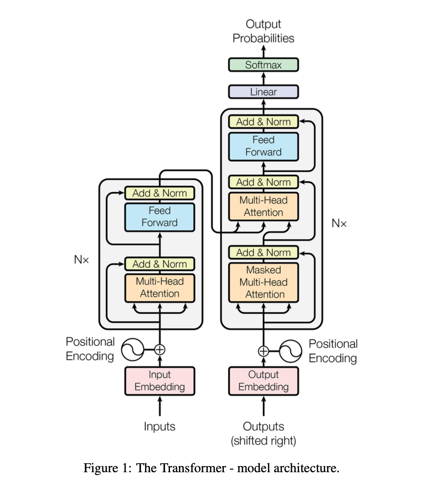

# Attention Is All You Need

## Abstract
当前主流的序列转换模型都基于包含编码器和解码器的复杂循环神经网络或卷积神经网络。性能最优的模型还会通过注意力机制连接编码器与解码器。我们提出一种全新的简洁网络架构——Transformer，它**完全基于注意力机制**，彻底摒弃了循环结构与卷积操作。在两项机器翻译任务上的实验表明，该模型不仅质量更优，还具备更强的并行计算能力，训练耗时显著减少。
我们的模型在WMT 2014英德翻译任务上取得**28.4的BLEU值**，较现有最优结果（包括集成模型）提升超过2个BLEU；在WMT 2014英法翻译任务上，经8块GPU训练3.5天后，创下**41.8**的单模型最新最优BLEU分数，训练成本仅为文献中最优模型的极小一部分。我们将Transformer成功应用于英文句法成分分析任务（无论训练数据量大小），证明其具备良好的泛化能力。

## 1 Introduction

循环神经网络（尤其是长短期记忆网络（LSTM）[13]和门控循环单元网络（GRU）[7]），已被**牢固确立**为序列建模与序列转换任务（如语言建模、机器翻译）的**主流前沿方法**[35, 2, 5]。此后，大量研究不断拓展循环语言模型与编码器–解码器架构的性能边界[38, 24, 15]。

循环模型通常会沿着输入与输出序列的符号位置**分解计算过程**。它们将位置与计算时间步对齐，基于前一时刻的隐藏状态 \(h_{t-1}\) 与位置 \(t\) 的输入，生成隐藏状态序列 \(h_{t}\)。这种**固有的串行特性**，使得训练样本内部无法实现并行计算；在序列更长时，这一问题会变得尤为关键，因为内存限制会制约样本间的批处理能力。
近期研究通过**分解技巧**[21]与**条件计算**[32]显著提升了计算效率，其中条件计算还同时改善了模型性能。然而，**串行计算的根本约束依然存在**。

注意力机制已成为各类任务中高性能序列建模与转换模型的**核心组成部分**，它能够对输入或输出序列中**无视距离依赖关系**进行建模[2, 19]。然而，除少数情况外[27]，这类注意力机制均与循环网络结合使用。

在本研究中，我们提出**Transformer**模型架构：它摒弃循环结构，完全依靠注意力机制来构建输入与输出之间的全局依赖。Transformer能够实现**大幅更高的并行度**，仅需在8块P100 GPU上训练12小时，即可达到翻译质量的全新业界顶尖水平。

## 2 Background
减少串行计算的目标，同样也是扩展神经GPU[16]、ByteNet[18]和ConvS2S[9]的设计基础。这些模型均以卷积神经网络为基本构建单元，对所有输入与输出位置**并行计算**隐层表示。

在这类模型中，关联任意两个输入或输出位置信号所需的运算量，会随位置间距离的增加而增长：ConvS2S呈**线性增长**，ByteNet呈**对数增长**。这使得学习远距离位置间的依赖关系变得更加困难[12]。

而在Transformer中，这一运算量被降至**常数级**，尽管代价是注意力加权位置平均会导致有效分辨率下降，我们会通过3.2节所述的**多头注意力**来抵消这一影响。

**自注意力（有时也称为内部注意力）** 是一种注意力机制，它通过关联单个序列中的不同位置来计算该序列的表示。自注意力已在多项任务中成功应用，包括阅读理解、抽象摘要、文本蕴含，以及学习与任务无关的句子表示 [4, 27, 28, 22]。

端到端记忆网络基于**循环注意力机制**，而非序列对齐的循环结构，已被证实在简单语言问答与语言建模任务上表现出色[34]。

然而据我们所知，**Transformer 是首个完全依靠自注意力来计算输入与输出表示、且不使用序列对齐的循环神经网络（RNN）或卷积的序列转换模型**。在接下来的章节中，我们将介绍 Transformer、阐述使用自注意力的动机，并讨论它相较于 [17, 18, 9] 等模型的优势。

## 3 Model Architecture

大多数高性能的神经序列转换模型都采用**编码器–解码器结构**[5, 2, 35]。其中，编码器将由符号表示组成的输入序列 \((x_1, …, x_n)\) 映射为连续表示序列 \(z=(z_1, …, z_n)\)。在得到 \(z\) 之后，解码器逐一生成由符号组成的输出序列 \((y_1, …, y_m)\)。该模型在每一步都是**自回归**的[10]，在生成下一个符号时，会将此前已生成的符号作为额外输入。

Transformer 遵循这一整体架构，在编码器和解码器中均使用**堆叠式自注意力层**与**逐点全连接层**，分别如图 1 左半部分与右半部分所示。

### 3.1 Encoder and Decoder Stacks

**编码器**：编码器由**N=6层**完全相同的网络层堆叠而成。每一层包含两个子层：第一个是**多头自注意力机制**，第二个是简单的**逐点全连接前馈网络**。我们在两个子层外围均采用**残差连接**[11]，随后接入**层归一化**[1]操作。也就是说，每个子层的输出为：LayerNorm(x + Sublayer(x))，其中Sublayer(x)表示子层自身实现的函数。为了适配这些残差连接，模型中所有子层以及嵌入层的输出维度均设置为 **d_model=512**。

**解码器**：解码器同样由 **N=6层** 完全相同的网络层堆叠而成。除了编码器层中的两个子层外，解码器还插入了**第三个子层**，该子层对编码器堆叠的输出执行**多头注意力**机制。与编码器类似，我们在每一个子层外围都采用了**残差连接**，随后进行**层归一化**。我们还对解码器中的自注意力子层进行了修改，以防止某个位置关注到**后续位置**的信息。这种**掩码（Masking）**机制，结合输出嵌入在位置上**向右偏移一位**的设计，确保了针对位置 \(i\) 的预测，仅依赖于**位置 \(i\) 之前的已知输出**。

### 3.2 Attention

